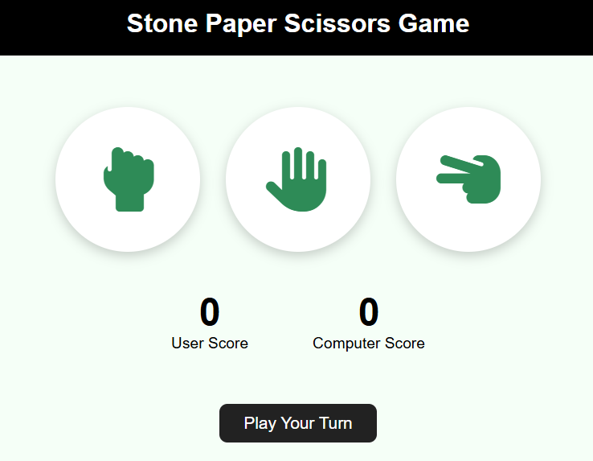

<h1 align="center">✊✋✌️ Rock Paper Scissors Game</h1>


<p align="center">
A classic Rock Paper Scissors game built with vanilla JavaScript — pick your move, the computer picks its own at random, and the score updates instantly with a clean, responsive UI.
</p>

<p align="center">

🌐 [Live Demo](https://handsfight.netlify.app/)

</p>

---

## Preview

<p align="center">
  
</p>

---

## Features

- Three clickable choice cards (Rock, Paper, Scissors) using Font Awesome hand icons
- Randomized computer move generated on every round
- Instant win/lose/draw detection with a live result message
- Live scoreboard tracking User Score vs Computer Score throughout the session
- Smooth hover and scale animations on each choice card
- Fully responsive layout with dedicated breakpoints for tablet, mobile, and small mobile screens

---

## Built With

- HTML5
- CSS3 — Flexbox, Media Queries & Animations
- JavaScript (ES6)
- [Font Awesome](https://fontawesome.com/) for hand icons
- Netlify — Deployment

---

## Getting Started

Clone the repository:

```bash
git clone https://github.com/chitrangna-dev/rock-paper-scissors.git
```

Move into the project folder:

```bash
cd rock-paper-scissors
```

Open `index.html` in your preferred web browser.

Or just try it live: [handsfight.netlify.app](https://handsfight.netlify.app/)

---

## Deployment

The game is deployed on Netlify and connected to GitHub for streamlined deployment.

🌐 Live Demo: [handsfight.netlify.app](https://handsfight.netlify.app/)

---

## Project Structure

```
rock-paper-scissors/
├── index.html
├── style.css
├── script.js
└── assets/
    └── preview.PNG
```

---

## How It Works

Each choice card (`#stone`, `#paper`, `#scissors`) has a click listener that reads the player's pick from its `id`, then `generateComputerChoice()` picks randomly from the same three options. `playGame(user, computer)` compares the two: a draw is called out immediately, otherwise a small set of win conditions decides the round and updates either the user's or computer's score paragraph, along with a live result message.

---

## Why I Built This

I built this to practice DOM event handling and simple game-state logic — comparing two values against a fixed set of win conditions, keeping score in sync with the DOM, and making the whole thing feel responsive with just a few hover and scale transitions.

---

## Possible Improvements

- Add a "Best of 5 / Best of 10" match mode with a winner announcement
- Add sound effects for win, lose, and draw
- Add a reset button to clear the scoreboard
- Animate the computer's choice reveal instead of an instant message
- Add keyboard support (number keys or arrow keys to pick a move)
- Add a round history log showing past moves and outcomes

---

## Author

**Chitrangna**

First-year B.Tech CSE student building toward full-stack development with the MERN stack. Passionate about clean UI, meaningful projects, and continuous learning.

Feel free to explore the project or share your feedback.

---

## License

This project is licensed under the MIT License.
